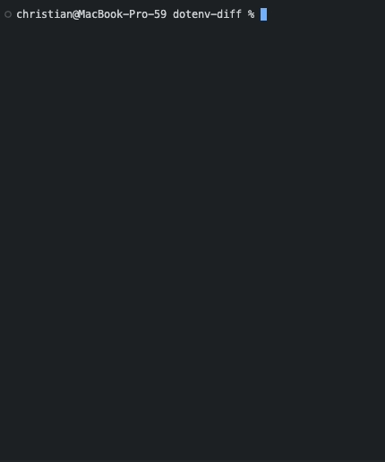

# dotenv-diff

Scan your codebase to detect every environment variable reference. It helps you catch missing, unused, duplicated, and misused variables early, before they cause runtime errors.

First-class support for SvelteKit, Next.js, and Nuxt. Also works well in modern JavaScript/TypeScript projects and frameworks like Node.js and Vue — or any other setup where you want reliable .env file comparison.

[](https://codecov.io/gh/Chrilleweb/dotenv-diff)
[](https://scorecard.dev/viewer/?uri=github.com/Chrilleweb/dotenv-diff)
[](https://www.npmjs.com/package/dotenv-diff)
[](https://www.npmjs.com/package/dotenv-diff)

> **✨ Featured in [awesome-cli-apps](https://github.com/agarrharr/awesome-cli-apps#development)** - A curated list of awesome CLI applications

---



---

## Why dotenv-diff?

- Ensure all required environment variables are defined before deploying
- Catch missing or misconfigured variables early in development
- Improve collaboration by keeping teams aligned on required variables
- Reduce the risk of committing sensitive data
- Scale easily for monorepos and multi-environment setups

---

## How It Works

→ See [Capabilities Documentation](./docs/capabilities.md) for details on what the scanner checks for and how it works.

---

## Configuration (`--init`)

Generate a default configuration file:

```bash
dotenv-diff --init
```

→ See [Configuration Documentation](./docs/configuration_and_flags.md#configuration-file) for more details.

---

## Git hooks and CI/CD Integration

Easily integrate dotenv-diff into your Git hooks or CI/CD pipelines to enforce environment variable consistency.

→ See [Git Hooks Documentation](./docs/git_hooks_ci.md) for more details.

## Framework-Specific Warnings

In SvelteKit, Next.js, and Nuxt projects, dotenv-diff detects framework-specific
environment variable misuses.

Example warning:

```bash
Framework issues (Sveltekit):
  - PUBLIC_API_URL (src/routes/+page.ts:1)
    → $env/dynamic/private variables must not start with "PUBLIC_"
```

→ See [Framework Documentation](./docs/frameworks/index.md) for more details.

## Ignore Comments

You can ignore specific environment variable warnings by adding comments in your code. For example:

```javascript
const apiKey = process.env.API_KEY; // dotenv-diff-ignore
```

This is helpful when you know a specific warning is safe in your source code.

→ See [Ignore Comments Documentation](./docs/ignore_comments.md) for more details.

---

## Expiration Warnings

Add expiration metadata to your environment variables to get warnings when they are about to expire. For example, in your `.env` file:

```bash
# @expire 2025-12-31
API_TOKEN=
```

→ See [Expiration Documentation](./docs/expiration_warnings.md) for more details.

---

## Suppress existing warnings (`--baseline`)

Adopt dotenv-diff in projects that already have known warnings by recording the current state into a baseline file. Future runs will only report newly introduced issues:

```bash
dotenv-diff --baseline
```

→ See [Baseline Documentation](./docs/baseline.md) for more details.

---

## Explain a variable (`--explain`)

Inspect a specific environment variable to see where it is defined, where it is used in the codebase, and its overall status:

```bash
dotenv-diff --explain DATABASE_URL
```

→ See [--explain Documentation](./docs/configuration_and_flags.md#--explain-key) for more details.

---

## Monorepo support

In monorepos with multiple apps and packages, you can include shared folders:

```json
{
  "scripts": {
    "dotenv-diff": "dotenv-diff --example .env.example --include-files '../../packages/**/*' --ignore VITE_MODE"
  }
}
```

→ See [Monorepo Documentation](./docs/monorepo_support.md) for more details.

This will:

- Scan the current app
- Include shared packages
- Ignore variables used only in specific environments

---

## Exit Codes

- `0` → No errors
- `1` → Errors found (or warnings in strict mode)

---

## Documentation

→ See [dotenv-diff Documentation](./docs/index.md) for full documentation

---

## Contributing

Issues and pull requests are welcome.  
→ See [CONTRIBUTING](./CONTRIBUTING.md) for details.

Thanks to these amazing people for contributing to this project:

<a href="https://github.com/Chrilleweb/dotenv-diff/graphs/contributors">
  
</a>

---

## License

Licensed under the [MIT](LICENSE) license.

Created by [chrilleweb](https://github.com/chrilleweb)
