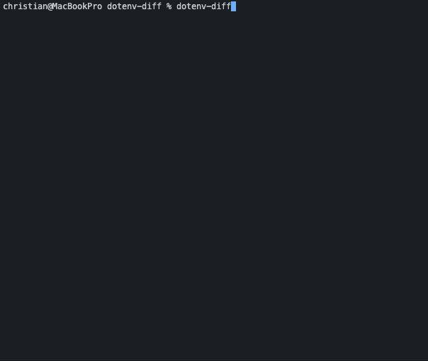

# dotenv-diff



Scan your codebase to detect which environment variables are used in your code.

Optimized for SvelteKit and Next.js. </br>
Also works well in modern JavaScript/TypeScript projects and frameworks like Node.js, Nuxt, and Vue — or any other setup where you want reliable .env file comparison / scanning.

[](https://www.npmjs.com/package/dotenv-diff)
[](https://www.npmjs.com/package/dotenv-diff)

---

## Why dotenv-diff?

- Ensure all required environment variables are defined before deploying.
- Catch missing or misconfigured variables early in development.
- Improve collaboration: Keep your team aligned on necessary environment variables.
- Enhance security: Ensure sensitive variables are not accidentally committed to version control.
- Scale confidently: Perfect for turbo monorepos and multi-environment setups.

### Use it in Github Actions Example:

```yaml
- name: Check environment variables
  run: dotenv-diff --example .env.example
```

You can also change the comparison file by using the `--example` flag to point to a different `.env.example` file. 

```bash
dotenv-diff --example .env.example.staging
```

If your project doesn’t use a .env.example file, you can simply run dotenv-diff without any arguments.
It will scan your codebase for environment variable usage, but won’t compare against an example file.

```bash
dotenv-diff
```

## Use it in a Turborepo Monorepo

In a monorepo setup (e.g. with Turborepo), you often have multiple apps under apps/ and shared packages under packages/.
You can run dotenv-diff from one app and still include files from your packages folder.

For example, if you want to scan from the apps/app1 folder and also include code in packages/auth, you can do:

```json
{
  "scripts": {
    "dotenv-diff": "dotenv-diff --example .env.example --include-files '../../packages/**/*' --ignore VITE_MODE"
  }
}
```

This will:
- Compare the variables used in your `apps/app1` code against `apps/app1/.env.example`.
- Also scan files in `../../packages`(like `packages/components/src/..`)
- Ignore variables like VITE_MODE that you only use in special cases (.env.test).

## Automatic fixes with `--fix`

Use the `--fix` flag to automatically fix missing keys in your `.env`.

```bash
dotenv-diff --fix
```

### Example workflow

1. You have `process.env.NEW_API_KEY` in your code.
2. You run `dotenv-diff --fix`.
3. The tool automatically adds `NEW_API_KEY=` to your `.env` file.

## Strict mode - treat warnings as errors

You can use the `--strict` flag to treat all warnings as errors. This is useful for CI environments where you want to ensure that no warnings are present in the codebase.

```bash
dotenv-diff --strict
```

## Sveltekit and Next.js specific warnings

When scanning a SvelteKit project, `dotenv-diff` will warn you about environment variables that are used wrong in sveltekit or Next.js depending on which framework is detected.

for example, if you have `const key = import.meta.env.API_KEY` in a +page.svelte file, you will get a warning to use `VITE_` prefix for client-side usage.

You would likely see this waring:

```bash
Environment variable usage issues:
   - PUBLIC_URL (src\routes\+page.ts:1) → Variables accessed through import.meta.env must start with "VITE_"
```

This will help you avoid runtime errors due to misconfigured environment variables in SvelteKit and Next.js projects.

## Detect potential secrets in your .env.example file 

When you run `dotenv-diff` it will also scan your `.env.example` file for potential secrets, such as API keys or passwords.

for example: 

```bash
Potential real secrets found in .env.example:
   - API_KEY = "sk_test_4eC39HqLyjWDarjtT1zdp7dc" → Value in .env.example matches a known provider key pattern [high]
```

This helps you avoid accidentally committing sensitive information through your example files.

## Accidentally logging environment variables to console?

`dotenv-diff` can also detect when environment variables are being logged to the console in your codebase.

For example, if you have code like this:

```js
console.log(process.env.API_KEY);
```

This will trigger a warning.

## ignore specific warnings

You can use the `dotenv-diff-ignore` comment to ignore specific lines from secret detection. For example:

```js
const secret ="https://thisurlshouldbeignored.com"; // dotenv-diff-ignore
const ignoredEntropy = "AIzaSyA-1234567890abcdefgHIJKLMNOpqrstuv" // dotenv-diff-ignore;
```

This will prevent `dotenv-diff` from flagging the line as a potential secret.

## Healthscore 

`dotenv-diff` includes by default a health score feature that provides an overall assessment of your project's environment variable management.

The health score is calculated based on several factors, including:
- The number of missing environment variables.
- The presence of potential secrets exposed in your codebase.
- The use of uppercase naming conventions for environment variable keys.
- Logged environment variables in the codebase.
- Unused variables in your `.env` or `.env.example` file.
- Framework specific warning for SvelteKit or Next.js (depending on detected framework).

## Expiration date warnings

By default, `dotenv-diff` will detect environment variables with expiration dates and warn you if they are expired or about to expire.
To specify an expiration date for an environment variable, add a comment in the following format on the same line this an example of a .env.example file:

```bash
# @expire YYYY-MM-DD
API_TOKEN=
```

When you run `dotenv-diff`, it will check the expiration dates and display warnings for any variables that are expired or will expire soon.

## Inconsistent naming pattern warnings

By default `dotenv-diff` will detect environment variables that have inconsistent naming patterns, fx `APIKEY` & `API_KEY` will give you are warning to only use the `API_KEY`
To disable this behavior, use the `--no-inconsistent-naming-warnings` flags respectively, or set it to false in the config file:

```bash
"inconsistentNamingWarnings": false
``` 

## Show unused variables

As default, `dotenv-diff` will list variables that are defined in `.env` but never used in your codebase.

To disable this behavior, use the `--no-show-unused` flag:
```bash
dotenv-diff --no-show-unused
```
This will prevent the tool from listing variables that are defined in `.env` but not used in your codebase.

## Show statistics

By default, `dotenv-diff` will show statistics about the scan, such as the number of files scanned, variables found, and unique variables used.

To disable this behavior, use the `--no-show-stats` flag:

```bash
dotenv-diff --no-show-stats
```
This will prevent the tool from displaying statistics about the scan.

## include or exclude specific files for scanning

You can specify which files to include or exclude from the scan using the `--include-files` and `--exclude-files` options:

```bash
dotenv-diff --include-files '**/*.js,**/*.ts' --exclude-files '**/*.spec.ts'
```

By default, the scanner looks at JavaScript, TypeScript, Vue, and Svelte files.
The --include-files and --exclude-files options let you refine this list to focus on specific file types or directories.

### Override with `--files`

If you want to completely override the default include/exclude logic (for example, to only include specific files), you can use --files:
```bash
dotenv-diff --files '**/*.js'
```

## Optional: Check values too

```bash
dotenv-diff --check-values --compare
```

When using the `--check-values` option together with `--compare`, the tool will also compare the actual values of the variables in `.env` and `.env.example`. It will report any mismatches found and it also compares values if .env.example defines a non-empty expected value.

## Ignore specific keys

Exclude certain keys from the comparison using `--ignore` for exact names or `--ignore-regex` for patterns:

```bash
dotenv-diff --ignore API_KEY,SESSION_ID
dotenv-diff --ignore-regex '^SECRET_'
dotenv-diff --ignore API_KEY --ignore-regex '^SECRET_'
```

Ignored keys are removed from all warnings and do not affect the exit code.

## Uppercase environment variable keys

`dotenv-diff` can detect environment variable keys that are not in uppercase format, which is a common convention for environment variables.

If any non-uppercase keys are found, a warning will be displayed showing the suggested uppercase version.
You can disable this check using the `--no-uppercase-keys` flag (enabled by default):

```bash
dotenv-diff --no-uppercase-keys
```

## Create a sample config file with --init

You can create a sample `dotenv-diff.config.json` file in your current directory using the `--init` flag:

```bash
dotenv-diff --init
```

This will generate a `dotenv-diff.config.json` file with default settings. If the file already exists, it will notify you and do nothing.

The generated config file could look like this:

```json
{
  "strict": false,
  "example": ".env.example",
  "ignore": [
    "NODE_ENV",
    "VITE_MODE"
  ],
  "ignoreUrls": [
    "https://example.com"
  ]
}
```

This allows you to customize the behavior of `dotenv-diff` without needing to pass all options via the command line.

## Output format in JSON

You can output the results in JSON format using the `--json` option:

```bash
dotenv-diff --json
```

## Disable colored output

By default, `dotenv-diff` uses colored output to enhance readability.

If you prefer plain text output, you can disable colored output using the `--no-color` option:

```bash
dotenv-diff --no-color
```

## Compare specific files

The `--compare` flag will compare all matching .env* files in your project against .env.example, including:
- `.env`
- `.env.local`
- `.env.production`
- Any other .env.* file

Override the autoscan and compare exactly two files:

```bash
dotenv-diff --compare --env .env.local --example .env.example.local
```

You can also fix only one side. For example, force a particular `.env` file and let the tool find the matching `.env.example`:

When using the `--compare` flag, `dotenv-diff` warns when a `.env*` file contains the same key multiple times. The last occurrence wins. Suppress these warnings with `--allow-duplicates`.

Use the `--only` flag to restrict the comparison to specific categories. For example:

```bash
dotenv-diff --only missing,extra
```
This will only show missing and extra keys, ignoring empty, mismatched, duplicate keys and so on.

## Automatically create missing files

Run non-interactively in CI environments with:

```bash
dotenv-diff --compare --yes    # auto-create missing files without prompts
```

You can also use `-y` as a shorthand for `--yes`.

### Automatic file creation prompts

If one of the files is missing, `dotenv-diff` will ask if you want to create it from the other:

- **`.env` missing** → prompts to create it from `.env.example`
- **`.env.example` missing** → prompts to create it from `.env` *(keys only, no values)*

This makes it quick to set up environment files without manually copying or retyping variable names.

### Also checks your .gitignore

`dotenv-diff` will warn you if your `.env` file is **not** ignored by Git.  
This helps prevent accidentally committing sensitive environment variables.

## 🤝 Contributing

Contributions are welcome! Feel free to open an issue or a pull request.

## License

MIT

### Created by [chrilleweb](https://github.com/chrilleweb)